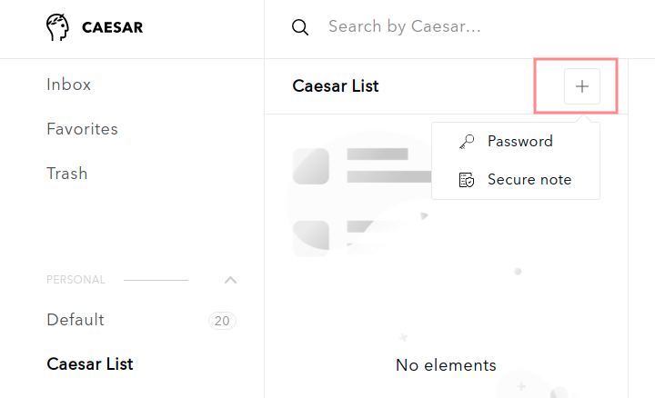

# Create new secure items manually

To add a new secure item \(login credentials or notes\) you need to follow the steps: 

1. In your dashboard choose a list \(personal or team list\), where you want to store new items

2. Click on **+** **button** and choose whether you want to create a new password or a new secure note

3.  If you want to add **a new password**:

1. You have to set **a title**
2. You have to fill in **a login**
3. You have to fill in **a password**
4. You can **add notes**
5. You can **add attachments** \(one attachment cannot be more than 256 kb; all attachments cannot be more than 5 mb\)

Click on **Add** to save the new password.

4. If you want to add **a new secure note**:

1. You have to set **a title**
2. You can **add notes**
3. You can **add attachments** \(one attachment cannot be more than 256 kb; all attachments cannot be more than 5 mb\)

Click on **Add** to save the new secure note.

