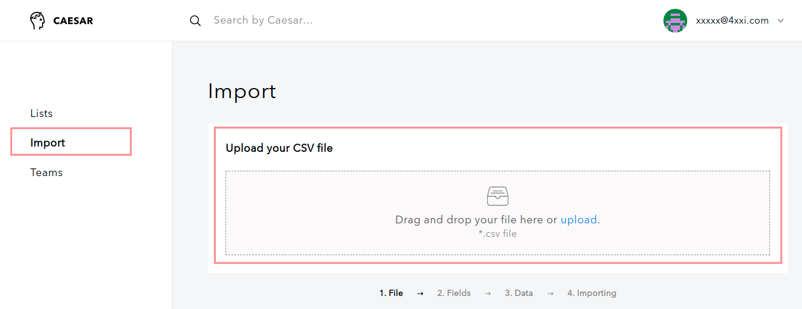

# Import secure items into Caesar.Team

To import secure items \(login credentials or notes\) you need to follow the steps: 

1. Open **Settings**

2. Then go to **Import**, where you need to **upload you .csv** 

3. Match Caesar.Team columns with columns in your .csv file and press **Submit**

4. You can see a list of items to be uploaded:

1. You can un-check items if you do not want to upload them
2. You can change the type of item: from password to secure note
3. You can choose team or list in which you want to upload the items

5. You will see new items in a chosen list as soon as importing is done

