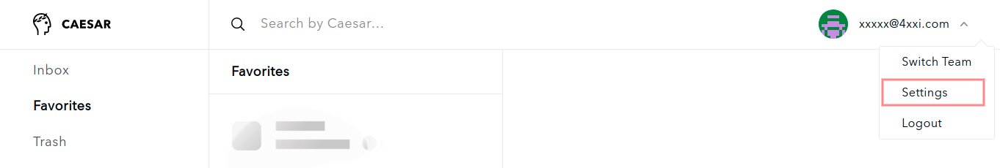

# Working with lists

### Create and edit new lists

1. To create and edit lists open **Settings**

2. Go to **Lists** and click on **Add list**

3. Set **a name** for the list and click on **Create**

### Add and move items to lists

