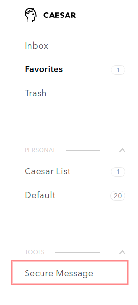
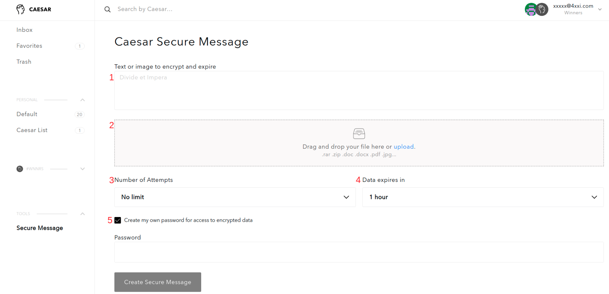
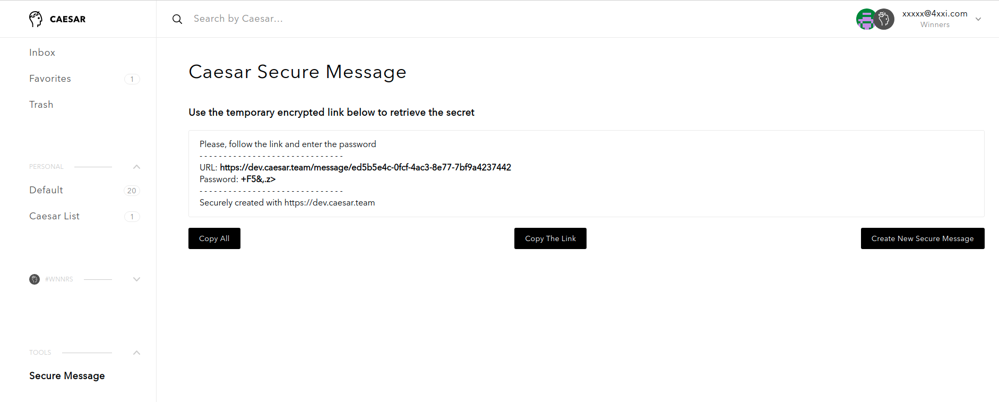

# Secure Messages

Secure Message is a tool to share temporary secure data:

* Secure messages are encrypted locally so hackers cannot access data
* Encrypted secure messages are stored on Caesar.Team. servers until expiration date
* Number of attempts to see secure message can be limited

To create a new secured message you need to follow the steps: 

1. Open **Secure Message** \(option in the dashboard menu\)

2. To create a secure message you can:

1. Add **description or text note**
2. Add **attachments** \(one attachment cannot be more than 256 kb; all attachments cannot be more than 5 mb\)
3. Set a number of attempts - how many time recipients of the secure message have access to it
4. Set expiration period - how long recipients of the secure message have access to it
5. Set your own access password \(if you do not want to create your personal password, you can use an auto-generated password\)

Click on **Create Secure Message**

3. As soon as the secure message is created and encrypted, you receive a link that you can share. 

Do not forget to share the password as well since your recipients need it to have access to the secure message

