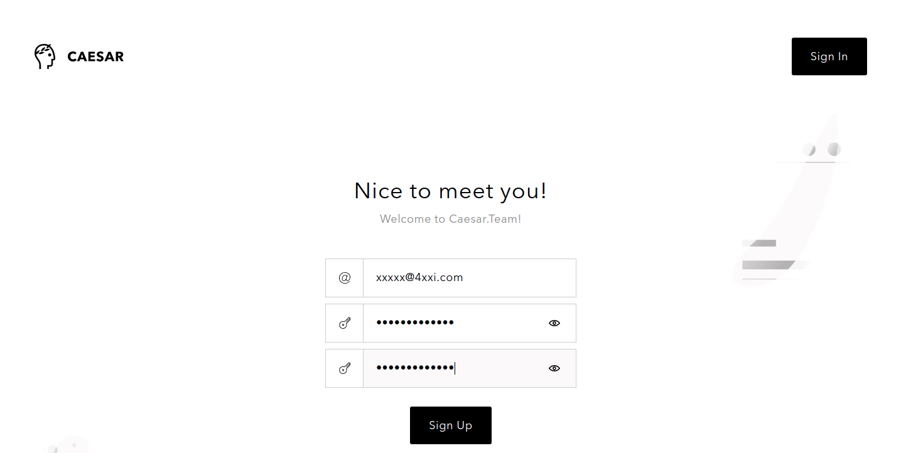
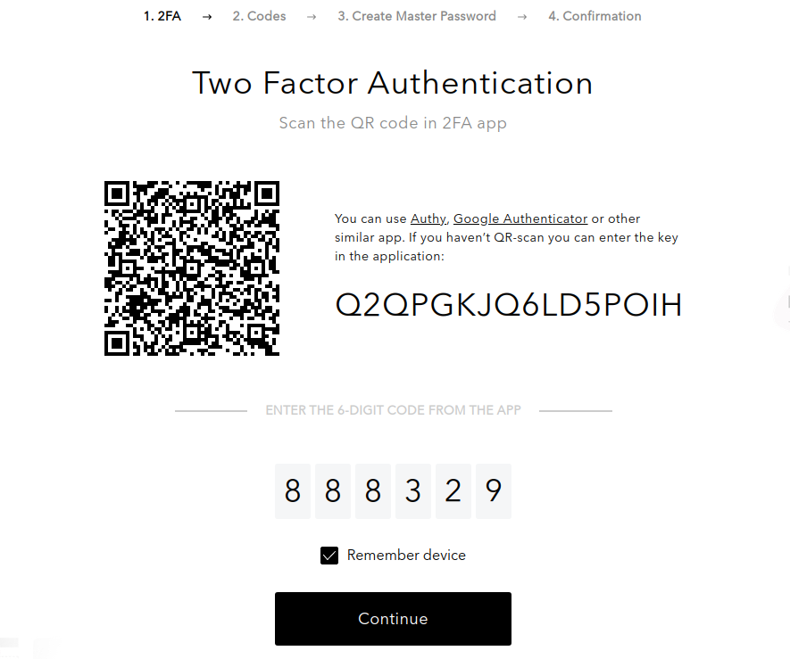
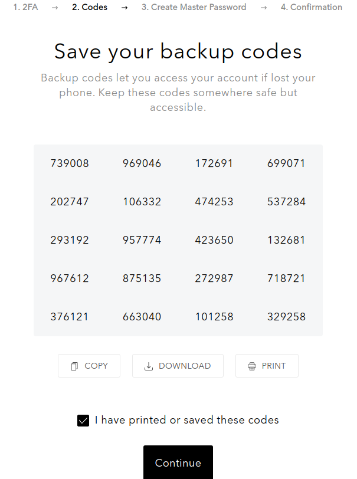

# Create Caesar.Team account

Get started with Caesar.Team by creating your personal account.

If your company has purchased Caesar.Team, you can create an account by yourself using your corporate email address

If you are not a part of a company and you need access to the application, you can sign up via an invitation link \(you can receive it, if someone shares a secure data with you\)

## Create a Caesar.Team account by yourself

1. Click on **Sign up** at the login page
2. Fill in your **Email address**, set and confirm **your account password**, click on **Sign Up**.

3. Enter your **email address and account password** at the sign in page and click **on Sign in**.

4. You will be redirected to the **Two Factor Authentication \(2FA\)** step. Please follow the instruction that you see on the screen.

If you do not want to go through 2FA every time you sign in, tick the box **Remember me**. 

Click on **Continue** to proceed to next steps.

5. Make sure you have your backup codes saved or printed \(you will need them in case you lose your device\).

To continue tick the box **I have printed or saved these codes**. 

##  Create a Caesar.Team account with invitation link

1. If you are not i

