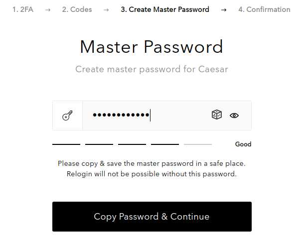

# Create Caesar.Team account

Get started with Caesar.Team by creating your personal account.

If your company has purchased Caesar.Team, you can [create an account by yourself ](https://github.com/caesar-team/docs/blob/master/user-documentation/create_account.md#create-a-caesarteam-account-by-yourself)using your corporate email address

If you are not a part of a company and you need access to the application, you can [sign up via an invitation link](https://github.com/caesar-team/docs/blob/master/user-documentation/create_account.md#create-a-caesarteam-account-with-invitation-link) \(you can receive it, if someone shares a secure data with you\).

Please go though all registration steps thoughtfully as you cannot go back to the previous steps!

## Create a Caesar.Team account by yourself

If your company has purchased Caesar.Team, you can create an account by yourself using your corporate email address.

1. Click on **Sign up** at the login page.

Or if you have a Google account click on **Log in with Google.**

2. Fill in your **Email address**, set and confirm **your account password**, click on **Sign Up**.

3. Enter your **email address and account password** at the sign in page and click **on Sign in**.

4. You will be redirected to the **Two Factor Authentication \(2FA\)** step. Please follow the instruction that you see on the screen.

If you do not want to go through 2FA every time you sign in, tick the box **Remember me**. 

Click on **Continue** to proceed to next steps.

5. Make sure you have your backup codes saved or printed \(you will need them in case you lose your device\).

To continue tick the box **I have printed or saved these codes**. 

6. Set you master password: **you set it manually or generate it** \(press the cube icon\). 

Click on **Copy Password & Continue** \(Make sure you saved you master password. If you lose it you will lose access to the application\).

7. Confirm the master password and click on Confirm

8. You will be redirected to the dashboard and you can work with your sensitive information now!

##  Create a Caesar.Team account with invitation link

If you are not a part of a company and you need access to the application, you can sign up via an invitation link \(you can receive it, if someone shares a secure data with you\)

1. As soon as someones shares a secure data with you, you will receive an invitation. Click on **Join Caesar.Team** in the email to follow the link.

2. You can set **Two Factor authentication** as described above

3. You need to set your **account password** and confirm it.

4. You need to set your **master password** as described above

5. You created your account and can access shared with you data \(you can confirm or decline it\). Click **Start work** to enter you dashboard.

