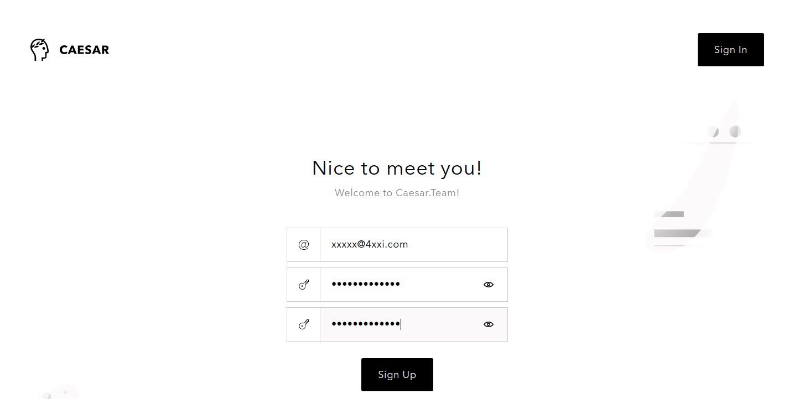

# Create Caesar.Team account

Get started with Caesar.Team by creating your personal account.

If your company has purchased Caesar.Team, you can [create an account by yourself](https://github.com/caesar-team/docs/blob/master/user-documentation/create_account/create-account-by-yourself.md) using your corporate email address

If you are not a part of a company and you need access to the application, you can [sign up via an invitation link](https://github.com/caesar-team/docs/blob/master/user-documentation/create_account/create-account-with-invitation-link.md) \(you can receive it, if someone shares a secure data with you\)

## Created account by yourself

1. Click on **Sign up** at the login page
2. Fill in your **Email address**, set and confirm **your account password**, click on **Sign Up**.

1. 
##  Get an invitation link

1. If you are not i

