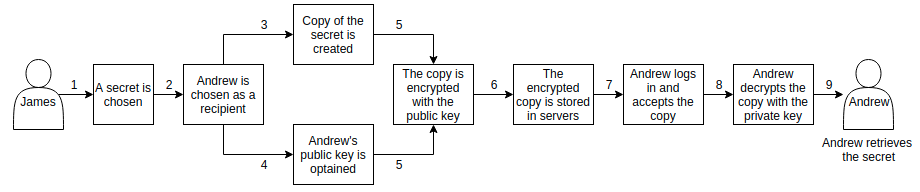

# Encryption technology

Caesar.Team encryption technology prevents the ability to decrypt storage data without using master password and private key.

Caesar.Team uses local encrypting which means data is encrypted and decrypted locally, on the user’s machine and no data is being encrypted and decrypted on the server side and if a hacker gets access to servers they will not be able to decrypt data and use it.

Caesar.Team employs highest standard encryption algorithms in order to protect data such as OpenPGP protocol. OpenPGP is a non-proprietary protocol for encrypting data using public key cryptography using elliptic curves.  Elliptic curve cryptography provides stronger security per bits of key, which allows for much faster operations.

Caesar.Team run encryption for every action made by user:

* When a user [creates login credentials or notes](https://github.com/caesar-team/docs/blob/master/user-documentation/encryption-technology.md#story-1-caesarteam-user-james-creates-a-secret)
* When a user shares login credentials or notes \([via Caesar.Team](https://github.com/caesar-team/docs/blob/master/user-documentation/encryption-technology.md#story-2-caesarteam-user-james-shares-a-secret-with-caesarteam-user-andrew) or [via anonymous links](https://github.com/caesar-team/docs/blob/master/user-documentation/encryption-technology.md#story-3-caesarteam-user-james-shares-a-secret-via-an-anonymous-link)\)
* When a user [shares temporary data](https://github.com/caesar-team/docs/blob/master/user-documentation/encryption-technology.md#story-4-caesarteam-user-james-shares-a-temporary-secret)

### **Story 1: Caesar.Team user James creates a secret**

1. When James creates a secret Caesar.Team converts the object \(including login credentials, notes and attachments\) to a string.
2. Then the string is encrypted with James’ 4096-bit RSA public key using AES-256 algorithm.
3. After the string is encrypted it is sent to Caesar.Team servers where the encrypted string is being stored.
4. To view an item James decrypts the encrypted string with his 4096-bit RSA private key using AES-256 algorithm

### **Story 2: Caesar.Team user James shares a secret with Caesar.Team user Andrew**

1. James chooses a secret to share
2. James chooses Andrew as a recipient
3. Caesar. Team creates a copy of the secret for Andrew and converts it to a string
4. Caesar.Team obtains Andrew’s 4096-bit RSA public key
5. Caesar.Team encrypts the string with Andrew’s 4096-bit RSA public key using AES-256 algorithm
6. Caesar.Team sends encrypted data to servers
7. Andrew logs into Caesar.Team and accepts the shared secret
8. Andrew decrypts the secret with his 4096-bit RSA private key using AES-256 algorithm
9. Andrew retrieves the data from the secret

### **Story 3: Caesar.Team user James shares a secret via an anonymous link**

### **Story 4: Caesar.Team user James shares a temporary secret**

1. James creates a temporary secret, so called “secure message”:

* he sets a number of attempts and expiration period when the secret can be retrieved
* he sets a password \(password can be created manually or generated by Caesar.Team\).

2. Then Caesar.Team encrypts the secure message with the password using AES-256 algorithm

3. As a result James receives an encrypted link and the password

4. Recipients use the password to retrieve the secret and its content until it expires

