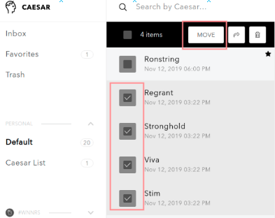
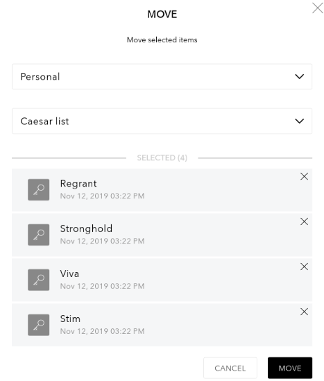
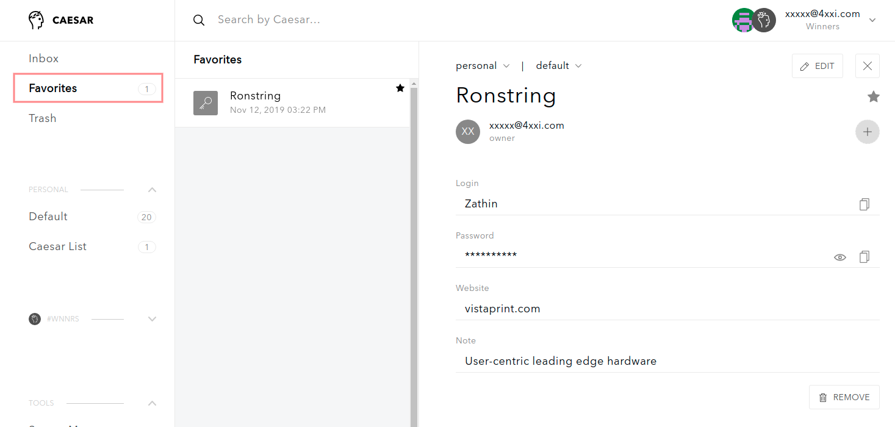

# How to manage items

**Caesar.Team allows user to create, store and keep up-to-date sensitive information, such as login credentials and notes.**

You have to ways to add secure items \(login credentials and notes\) to Caesar.Team applications:

1. You can [create them manually](https://github.com/caesar-team/docs/blob/master/user-documentation/managing_items.md#create-new-secure-items-manually)
2. You can [import](https://github.com/caesar-team/docs/blob/master/user-documentation/managing_items.md#import-secure-items-into-caesarteam) them via uploading a .csv file

Since you can have many secure items that you work with, it's convenient to separate the most needed items from other items. Check out how to [mark your secure items as favorite](https://github.com/caesar-team/docs/blob/master/user-documentation/managing_items.md#mark-favorite-items)

Since you might want to divide secure items into groups, check out [how to work with lists](https://github.com/caesar-team/docs/blob/master/user-documentation/managing_items.md#working-with-lists)

Since your items might become out-of-date Caesar.Team provides you a tool to update and remove items

## Create new secure items manually

To add a new secure item \(login credentials or notes\) you need to follow the steps: 

1. In your dashboard choose a list \(personal or team list\), where you want to store new items

2. Click on **+** **button** and choose whether you want to create a new password or a new secure note

3.  If you want to add **a new password**:

1. You have to set **a title**
2. You have to fill in **a login**
3. You have to fill in **a password**
4. You can **add notes**
5. You can **add attachments** \(one attachment cannot be more than 256 kb; all attachments cannot be more than 5 mb\)

Click on **Add** to save the new password.

4. If you want to add **a new secure note**:

1. You have to set **a title**
2. You can **add notes**
3. You can **add attachments** \(one attachment cannot be more than 256 kb; all attachments cannot be more than 5 mb\)

Click on **Add** to save the new secure note.

## Import secure items into Caesar.Team

To import secure items \(login credentials or notes\) you need to follow the steps: 

1. Open **Settings**

2. Then go to **Import**, where you need to **upload you .csv** 

3. Match Caesar.Team columns with columns in your .csv file and press **Submit**

4. You can see a list of items to be uploaded:

1. You can un-check items if you do not want to upload them
2. You can change the type of item: from password to secure note
3. You can choose team or list in which you want to upload the items

5. You will see new items in a chosen list as soon as importing is done

## Working with lists

Caesar.Team lists are designed to separate items into groups

### Create and edit new lists

1. To create and edit lists open **Settings**

2. Go to **Lists** and click on **Add list**

3. Set **a name** for the list and click on **Create**

### Add and move items to lists

1. You can add items to a list by [importing](https://github.com/caesar-team/docs/tree/master/user-documentation/managing_items#import-secure-items-into-caesarteam)
2. You can move a single item

* open the item
* choose whether you want to move to personal items or choose a team
* choose a list
* click **Move**

3. You can move several items at a time

* **Select** several items \(ctrl + click on chosen items\) and click on **Move**

* choose whether you want to move to personal items or choose a team
* choose a list
* check your selected items \(you can remove unwanted items\)
* click **Move**

## Mark favorite items

Since you can have a lot of secure items \(login credentials and secure notes\) to store and manage, Caesar.Team provides an option to mark the most needed items as favorites and to see such items in an additional list.

To separate chosen items as favorites you need to follow the steps: 

1. Choose the item and open it. Click on the ⭐ button

2. You can see the item in **Favorite list**

## Update items

## Remove items

