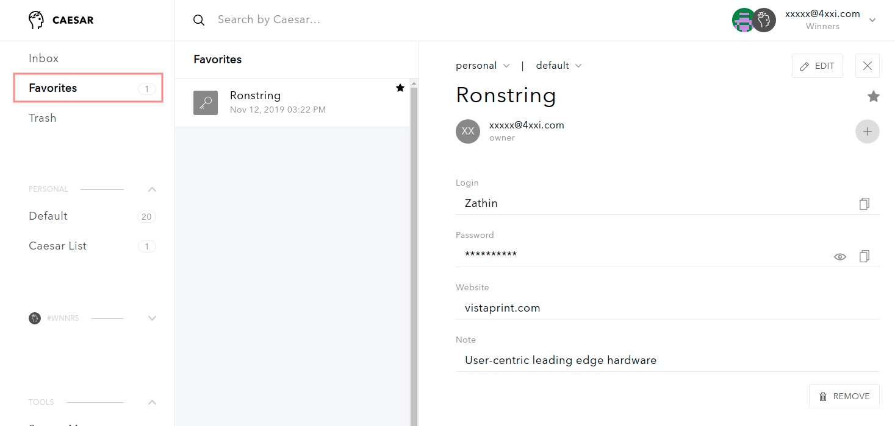

# How to manage items

**Caesar.Team allows user to create, store and keep up-to-date sensitive information, such as login credentials and notes.**

You have to ways to add secure items \(login credentials and notes\) to Caesar.Team applications:

1. You can [create them manually](https://github.com/caesar-team/docs/tree/master/user-documentation/managing_items#create-new-secure-items-manually)
2. You can [import](https://github.com/caesar-team/docs/tree/master/user-documentation/managing_items#import-secure-items-into-caesarteam) them via uploading a .csv file

Since you can have many secure items that you work with, it's convenient to separate the most needed items from other items. Check out how to [mark your secure items as favorite](https://github.com/caesar-team/docs/tree/master/user-documentation/managing_items#mark-favorite-items)

Since you might want to divide secure items into groups, check out [how to work with lists](https://github.com/caesar-team/docs/blob/master/managing_items/working-with-lists.md)

## Create new secure items manually

To add a new secure item \(login credentials or notes\) you need to follow the steps: 

## Import secure items into Caesar.Team

## Working with lists

## Mark favorite items

Since you can have a lot of secure items \(login credentials and secure notes\) to store and manage, Caesar.Team provides an option to mark the most needed items as favorites and to see such items in an additional list.

To separate chosen items as favorites you need to follow the steps: 

1. Choose the item and open it. Click on the ⭐ button

2. You can see the item in **Favorite list**

