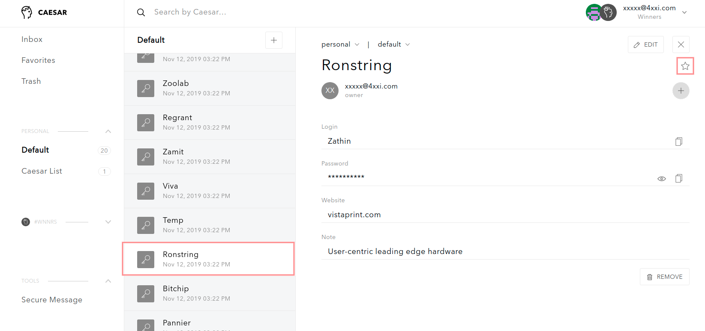

# Mark favorite items

Since you can have a lot of secure items \(login credentials and secure notes\) to store and manage, Caesar.Team provides an option to mark the most needed items as favorites and to see such items in an additional list.

To separate chosen items as favorites you need to follow the steps: 

1. Choose the item and open it. Click on the ⭐ button

2. You can see the item in **Favorite list**

