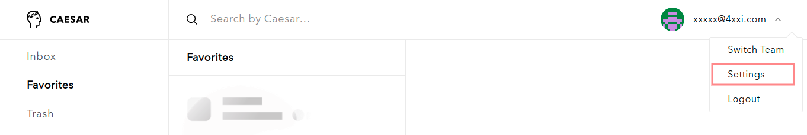
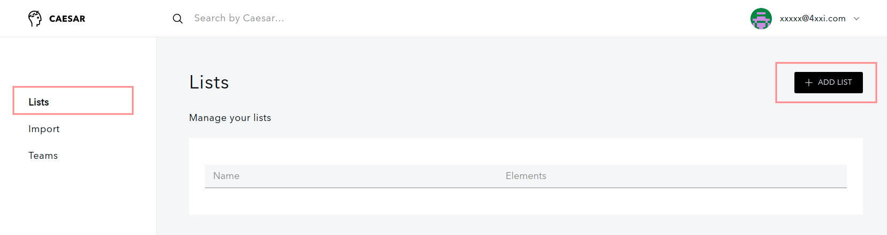
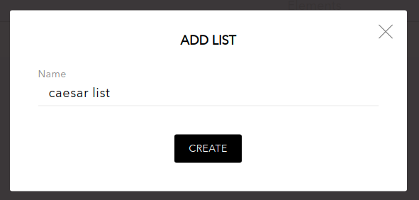
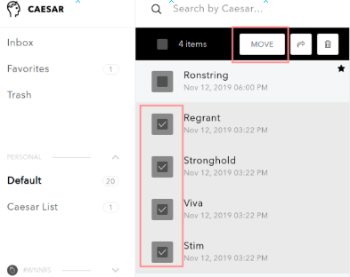
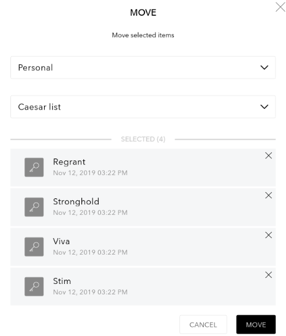

# Working with lists

### Create and edit new lists

1. To create and edit lists open **Settings**

2. Go to **Lists** and click on **Add list**

3. Set **a name** for the list and click on **Create**

### Add and move items to lists

1. You can add items to a list by [importing](https://github.com/caesar-team/docs/blob/master/managing_items/import-secure-items-into-caesar.team.md)
2. You can move a single item

* open the item
* choose whether you want to move to personal items or choose a team
* choose a list
* click **Move**

3. You can move several items at a time

* **select** several items \(ctrl + click on chosen items\) and click **Move**

* choose whether you want to move to personal items or choose a team
* choose a list
* check your selected items \(you can remove unwanted items\)
* click **Move**

\*\*\*\*

\*\*\*\*

