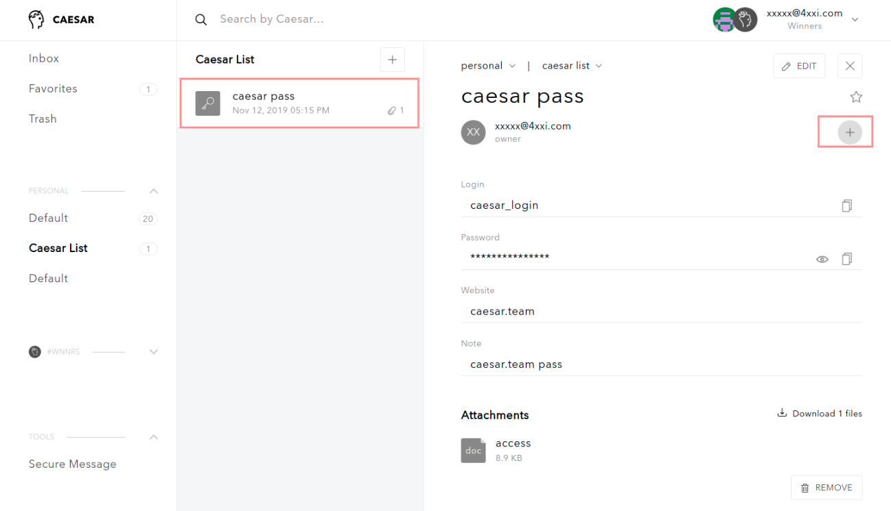
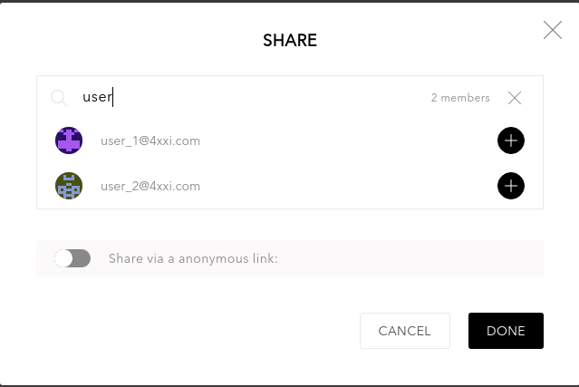
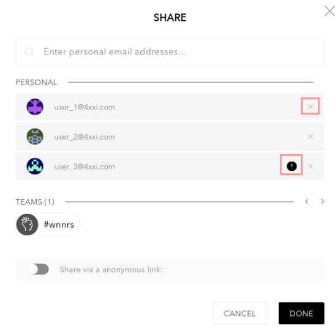
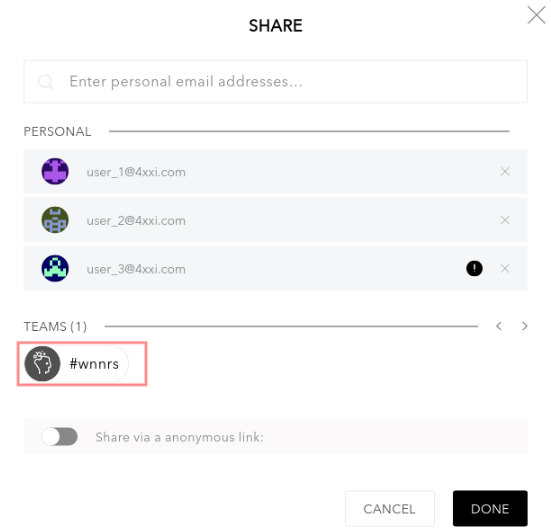
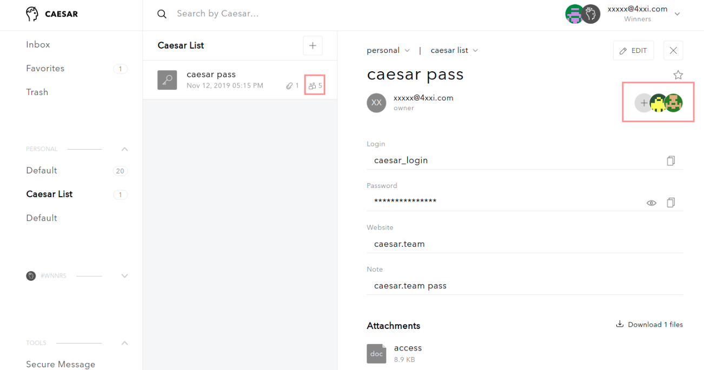
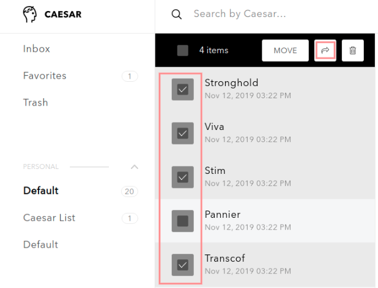
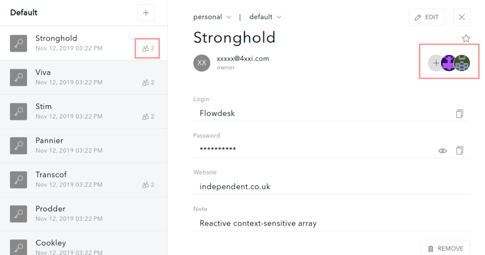
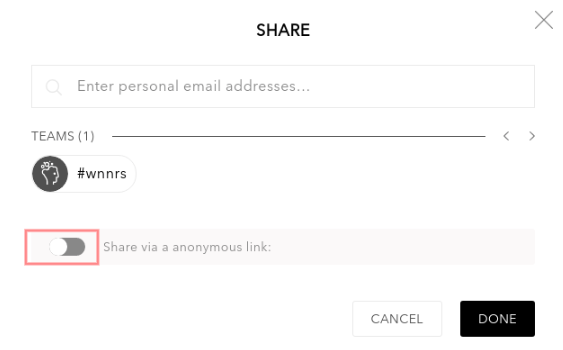
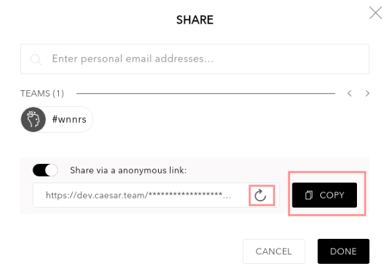

# How to share items

**Caesar.Team is a tool to share personal and team sensitive information such as login credentials, notes and docs:**

* You can share sensitive information [within the Caesar.Team application](https://github.com/caesar-team/docs/blob/master/user-documentation/sharing.md#sharing-within-the-caesarteam-application) and [via anonymous links](https://github.com/caesar-team/docs/blob/master/user-documentation/sharing.md#sharing-via-anonymous-links)
* You can choose who you want to share with: users and/or teams
* If somebody else shares sensitive information with you, you will receive Email notification.

## Sharing within the Caesar.Team application

You share your items \(login credentials and secure notes\) within the Caesar.Team:

* with Caesar.Team users
* with Caesar.Team teams
* with people outside of the Caesar.Team application

Please note that you can share [one item](https://github.com/caesar-team/docs/blob/master/user-documentation/sharing.md#share-1-item) or [several items](https://github.com/caesar-team/docs/blob/master/user-documentation/sharing.md#share-several-items) at a time. 

### Share 1 item

1. **Open the item** you want to share and click on **the + button** 

2. You can add users as recipients:

* **Enter emails** of recipients 
* To add a recipient click on **the + button**

3. You can see a list of recipients:

* You can remove a recipient from the list by clicking on the X button
* You can see recipient that are not Caesar.Team users - they are marked with ! sign

4. You can add teams by clicking on a team icon

5. Click on **Done** to share the item with chosen recipients

6. As soon as the item is shared, you can see final recipients and a number of them

### Share several items

1. **Select** several items \(ctrl + click on chosen items\) and click on **Share** icon

2. Now you can select recipients as [described above](https://github.com/caesar-team/docs/blob/master/user-documentation/sharing.md#share-1-item)

3. As soon as the items are shared, you can see final recipients and a number of them for each item

## Sharing via anonymous links

You share your items \(login credentials and secure notes\) with anyone using an anonymous link. 

Note that you can share only one item at a time via an anonymous link

1. **Open the item** you want to share and click on the **+** button 

3. In the pop-up use toggle to generate a link \(Note, that it might take some time\)

4. As soon as the link is generated:

* you can generate an other link
* you can copy the link to share

Click on **Done** when you have a copied link

