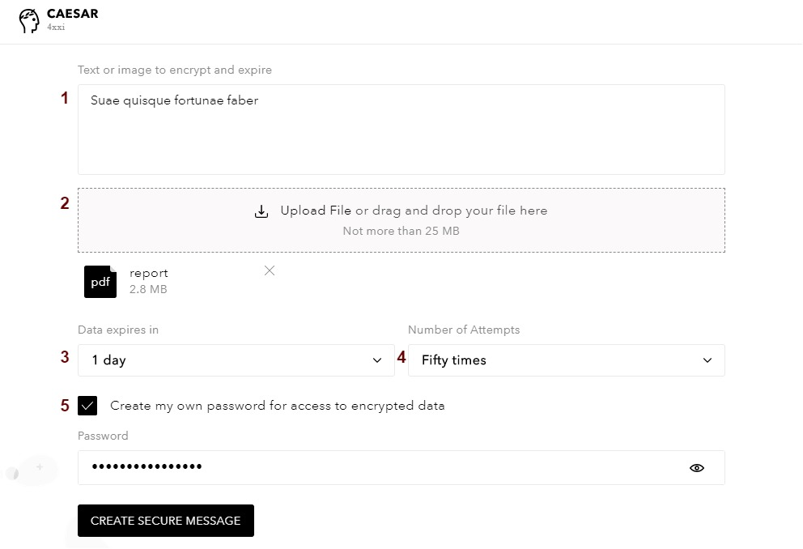

# Secure Messages

Secure Message is a tool to share temporary secure data:

* Secure messages are encrypted locally so hackers cannot access data
* Encrypted secure messages are stored on Caesar.Team servers until the expiration date
* Number of attempts to see secure message can be limited

#### This is how you can create secure messages:

1. Open Secure Messages

2. Add needed information and set the main characteristics

1. You can add **description or a text note**
2. You can add **attachments** \(attachments cannot be more than 5 Mb\)
3. You can set a **number of attempts** - how many times the secure message can be retrieved
4. You can set **expiration period** - the time until which the secure message can be retrieved
5. You can set **your own access password** or **you can use an auto-generated password**

3. After you click on the Create Secure Message button and once the secure message is encrypted, you get the link and you can copy it as well as the password.

4. After you follow the encrypted link you will be asked to enter the password.

5. And finally, you can retrieve the secret!

