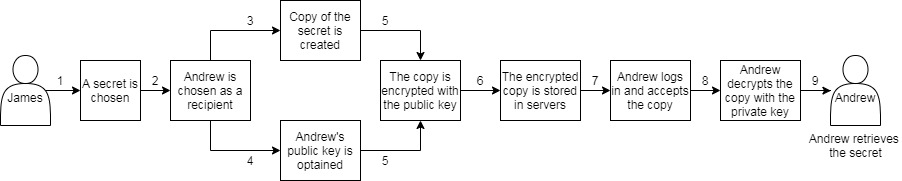

# White Paper

Caesar.Team is a two-part open-source software: client-side and backend-side applications. Caesar.Team mission is to keep sensitive data secure and provide reliable service to decrease the likelihood of password-related breaches. Caesar.Team is a tool designed for businesses to store team and personal secrets. 

Caesar.Team has the following features:

1. Reliable access to sensitive data
2. Client-side encryption so sensitive data transfer between the client-side & the server-side is always encrypted and the server stores sensitive data encrypted
3. Multi-factor authentication \(Account password, One Time Passwords, Master Password, Hardware Security Key\)
4. Access policy establishes access rights for each user or for a team
5. Secure sharing and access to shared data
6. Hybrid cryptography combines the convenience of public-key cryptography \(RSA 4096-bit\) with the efficiency of a symmetric-key \(AES-256\) cryptography and does not require the sender and receiver to share a common secret in order to communicate securely

Since Caesar.Team is an open-source software any developers can contribute and improve the client-side and backend-side applications to prevent possible attacks, and security threats or add new features.

## Registration & Authorization

### Master Password

When a user creates their Caesar.Team account they create a master password to generate private and public keys. The master password and the keys are used to encrypt and decrypt personal and team data:

* public and private keys are based on the user's email address
* AES-256 \(Cipher Block Chaining\) encryption algorithm with thousands of rounds of SHA-256 is used to create public and private keys
* a public key is used to encrypt information only a specific user can decrypt
* a private key is paired with a public key and is used to decrypt data and it is secured by the master password

Since the master password is stored locally and it is impossible to steal it. Private and public keys are stored on Caesar.Team server, they are encrypted and secured by the master password so if a hacker obtains them they cannot use them.

Users can create a master password manually or generate it, however, it is crucial to set a strong master password and not use the master password as a password for other services and apps.

### Two-Factor authentication

Caesar.Team uses two-factor authentication to add additional protection to data.

Caesar.Team is integrated with apps that provide two-factor authentication, such as Authy and Google Authenticator. Caesar.Team servers generate and store a two-factor authentication code that is sent to the application. Each time when a user tries to log in Caesar.Team they should use one-time code for two-factor authentication, which is verified by Caesar.Team servers. As two-factor authentication is linked to a device Caesar.Team allows saving back-up code in case of loss of the device

### Authorization flow

As displayed a user’s master password is stored locally and a server stores encrypted data and encrypted keys only.

## Encryption technology

Caesar.Team is a tool for businesses to store team and personal secrets. Caesar.Team users can store and keep up-to-date personal secrets as well as team secrets, users can group secrets together into lists, users can share their secrets and users can share temporary secrets.

Caesar.Team encryption technology prevents the ability to decrypt storage data without user's master password and private key.

Caesar.Team uses local encrypting which means data is encrypted and decrypted locally, on the user’s machine and no data is being encrypted and decrypted on the server-side and if a hacker gets access to servers they will not be able to decrypt data and use it.

Caesar.Team employs the highest standard encryption algorithms in order to protect data such as OpenPGP protocol. OpenPGP is a non-proprietary protocol for encrypting data using public-key cryptography using elliptic curves. Elliptic curve cryptography provides stronger security per bits of key, which allows for much faster operations.

Caesar.Team run encryption for every action made by a user:

* When a user creates login credentials or notes
* When a user shares login credentials or notes \(via Caesar.Team or via anonymous links\)
* When a user shares temporary data

Story 1: Caesar.Team user James creates a secret

1. When James creates a secret Caesar.Team converts the object \(including login credentials, notes, and attachments\) to a string.
2. Then the string is encrypted with James’ 4096-bit RSA public key using the AES-256 algorithm.
3. After the string is encrypted it is sent to Caesar.Team servers where the encrypted string is being stored.
4. To view an item James decrypts the encrypted string with his 4096-bit RSA private key using AES-256 algorithm

Story 2: Caesar.Team user James shares a secret with inside the domain Caesar.Team user Andrew

1. James chooses a secret to share
2. James chooses Andrew as a recipient
3. Caesar. Team creates a copy of the secret for Andrew and converts it to a string
4. Caesar.Team obtains Andrew’s 4096-bit RSA public key
5. Caesar.Team encrypts the string with Andrew’s 4096-bit RSA public key using AES-256 algorithm
6. Caesar.Team sends encrypted data to servers
7. Andrew logs into Caesar.Team and accepts the shared secret
8. Andrew decrypts the secret with his 4096-bit RSA private key using AES-256 algorithm
9. Andrew retrieves the data from the secret

Story 3: Caesar.Team user James shares a secret with out-of-domain user Jack

1. James chooses a secret to share
2. James fills in Jack’s email
3. Caesar.Team creates an account for Jack using his email address
4. Caesar.Team creates a master password, public and private keys for Jack and then Caesar.Team encrypts Jack’s public and private key with the master password
5. Caesar.Team creates a copy of the secret for Jack and converts it to a string
6. Caesar.Team encrypts the string with Jack’s preset 4096-bit RSA public key
7. Caesar.Team sends encrypted data to servers
8. Jack receives an invitation email to join Caesar.Team to get access to the shared secret
9. Jack sets his own master password which is used to re-encrypt his public and private keys
10. Jack logs into Caesar.Team, accepts the shared secret and decrypts it with his 4096-bit RSA private key to retrieve the data

Story 4: Caesar.Team user James shares a secret via an anonymous link

1. James chooses a secret to share
2. James requests Caesar.Team to generate an anonymous link
3. After James’ request Caesar.Team creates a temporary anonymous account \(email and password that are generated by Caesar.Team\) that exists as long as the anonymous link exists; Caesar.Team generates a master password which is used to encrypt public and private keys
4. Caesar.Team generates public and private keys
5. Caesar.Team creates a copy of the secret converts it to a string
6. Caesar.Team encrypts the string with the preset 4096-bit RSA public key
7. Caesar.Team sends encrypted data to servers
8. The anonymous link contains information: anonymous account credentials and the master password which is used to encrypt public and private keys
9. After a recipient follows the anonymous link authorization into Caesar.Team is automatical using email and password and master password that are hidden in the anonymous link
10. Caesar.Team uses the master password to decrypt the preset 4096-bit RSA private key
11. Caesar.Team decrypts the encrypted secret with the private key and the recipient retrieves the data

Story 5: Caesar.Team user James updates a shared secret

1. James updates a shared secret
2. Caesar.Team creates a new copy of the secret for each recipient
3. Caesar.Team obtains 4096-bit RSA public keys of each recipient
4. Caesar.Team encrypts each copy of the string with Andrew’s 4096-bit RSA public key using AES-256 algorithm
5. Caesar.Team sends encrypted data to servers
6. A recipient logs into Caesar.Team and accepts or declines the update
7. If the recipient accepts the update, they decrypt the updated version of the secret with their 4096-bit RSA private key using AES-256 algorithm and the encrypted previous version of the secret is removed from servers
8. If the recipient declines the update:
9. they see and can decrypt only the previous version of the secret with their 4096-bit RSA private key using AES-256 algorithm
10. servers do not store the updated version of the secret

Story 6: Caesar.Team user James shares a temporary secret

1. James creates a temporary secret, so-called “secure message”: he sets a number of attempts and expiration period when the secret can be retrieved and he sets a password \(password can be created manually or generated by Caesar.Team\).
2. Then Caesar.Team encrypts the secure message with the password using the AES-256 algorithm
3. As a result, James receives an encrypted link and the password
4. Recipients use the password to retrieve the secret and its content until it expires

## Account recovery

Caesar.Team supports multi-factor authentication \(Account password, One Time Passwords, Master Password, Hardware Security Key\) and since a user can lose their authorization credentials, Caesar.Team provides a chance to restore account and secrets in some cases.

1 Account password is lost

If a user lost their account password they can request a domain admin to reset the password so the user can set a new password

2 One time passwords are lost

Caesar.Team requires one time passwords that a user gets from a two-factor authentication application and theoretically a user can lose access to the application \(e.g. the user loses their phone\). To prevent this scenario Caesar.Team allows users to download and save one-time password.

If the user loses access to the 2FA application and loses the saved one time passwords they can request a domain admin to reset the password so the user can set a new password

3 The master password is lost

Since the user's master password is stored locally, on the user’s device, and Caesar.Team servers do not have access to it, Caesar.Team cannot rest the master password nor create a new master password.

If the user loses their master password they lose their Caesar.Team account and their secrets. However, they can request a domain admin to remove their account so they can create a new account.

## Reporting a security issue

The highest priority of Caesar.Team is security. The Caesar.Team development team guarantees a high level of service including quickly responding to and fixing reports of bugs or vulnerabilities. The Caesar.Team development team always welcome security research community and other developers to participate and contribute in order to maintain and improve Caesar.Team application.

Both potential issues and improvement suggestions can be reported in git and at security[@caesar.team](mailto:security@caesarteam.com). When reporting potential issues, the Caesar.Team development team asks users to be as thorough as possible in providing enough information to recreate their findings and eliminate possible issues as fast as possible.

